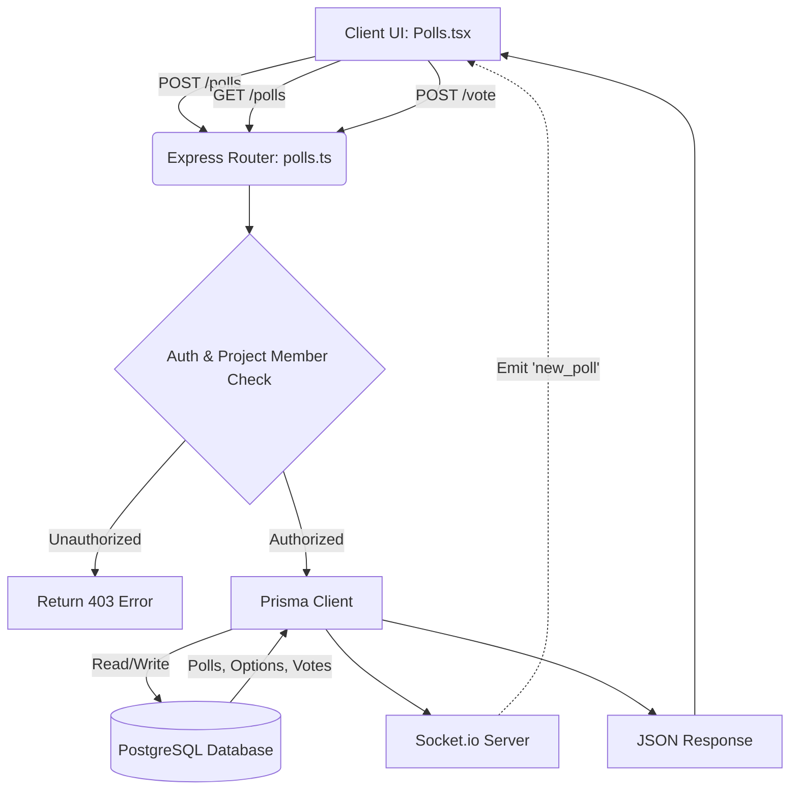
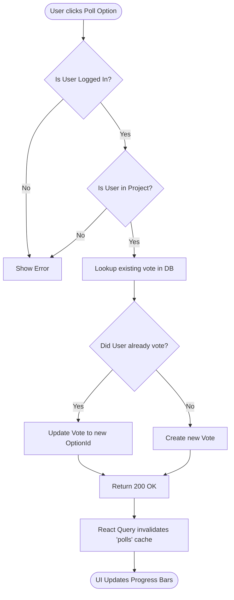

# Polls Feature Documentation

## Overview

The Polls feature allows project members to create custom polls with multiple options and vote on them in real-time. This module consists of the React frontend (`Polls.tsx`) and the Express backend controller (`polls.ts`).

## Code Explanation

### 1. Frontend (`src/pages/Polls.tsx`)

- **State Management**: Uses `useState` for the "Create Poll" modal dialog (`isDialogOpen`, `newQuestion`, `newOptions`).
- **Data Fetching (TanStack Query)**:
  - `useQuery` fetches all polls scoped to the `activeProject.id`.
  - `useMutation` (Create Poll) sends a `POST` request with the question and options array.
  - `useMutation` (Vote) sends a `POST` request to cast a vote on a specific option.
- **UI & UX**:
  - Displays a clean list of polls, showing the creator and creation date.
  - Calculates and displays a visual progress bar indicating the percentage of votes each option received.
  - Highlights the option that the current `user` voted for using `CheckCircle2`.

### 2. Backend (`server/controllers/polls.ts`)

- **`getPolls`**: Queries the `Poll` model via Prisma. Includes nested relations (`creator`, `options`, `votes`). Security check ensures the requesting user is a member of the project.
- **`createPoll`**: Validates input using Zod (`createPollSchema`). Creates the poll and its options in a single Prisma transaction. Emits a Socket.io `new_poll` event to the project room.
- **`voteOnPoll`**:
  - Verifies the poll option belongs to the specified poll.
  - Checks if the user already has a vote associated with this poll.
  - If a vote exists, it uses `prisma.vote.update` to change the `pollOptionId`.
  - If no vote exists, it uses `prisma.vote.create` to cast a new vote.

---

## Data Flow Diagram (DFD)

---

## Control Flow Diagram (Voting Logic)

